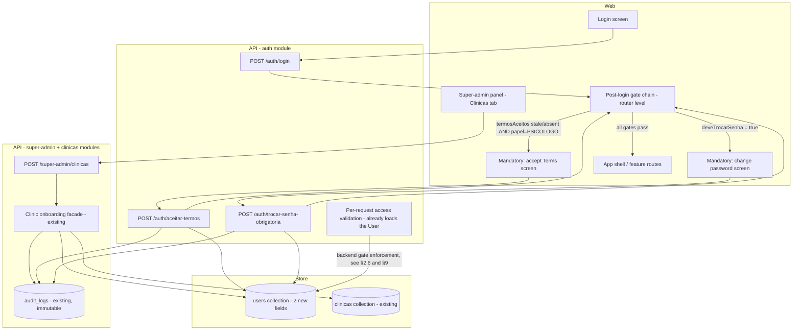

# TDD — Clinic Onboarding & Post-Login Auth Gates

Integrated design doc covering three features that share the same `User`
schema change, the same login-response contract change, and the same
post-login interception mechanism:

- `feature-super-admin-clinic-onboarding`
- `feature-forced-password-change`
- `feature-terms-of-service-acceptance`

Derives from: `docs/harness/features/feature-super-admin-clinic-onboarding.md`,
`docs/harness/features/feature-forced-password-change.md`,
`docs/harness/features/feature-terms-of-service-acceptance.md`. The Context
Pillars in §3 are copied verbatim from those files; they are the user's
answers and were not written or completed by the agent.

---

## 1. Header & Metadata

| Field | Value |
|-------|-------|
| Status | Draft — pending review |
| Features | Clinic onboarding (`feature-super-admin-clinic-onboarding`), forced password change (`feature-forced-password-change`), terms-of-service acceptance (`feature-terms-of-service-acceptance`) |
| Modules | `super-admin`, `clinicas`, `auth` (API); super-admin panel, app shell / router, login flow (web) |
| Tech lead | Erico Lima |
| Team | N/A — solo / small team, no formal squad |
| Epic / ticket | N/A — no epic-tracking system for this project. Originates from the session investigation that found clinic+admin creation was CLI-only in both `nuvita` and `nuvita-psi` (fork), and that no terms-acceptance mechanism exists for system users |
| Size | Medium–Large (2–5 weeks) |
| Project type | Auth + PII + production system |
| Created | 2026-09-10 |
| Last updated | 2026-09-10 |

---

## 2. Technical Solution

### 2.1 Decision summary

Three changes, one shared spine.

1. **Clinic onboarding from the UI.** A new admin-only endpoint exposes the
   already-implemented clinic-onboarding operation (clinic + first `ADMIN`
   user + 2FA provisioning + audit entry) over HTTP. The `SUPER_ADMIN` fills a
   minimal form; the backend **generates** the first admin's password (it is
   never typed by the super admin) and returns it once, together with the 2FA
   key, for the super admin to relay to the client. The created admin is
   flagged to change the password on first login.

2. **Forced password change.** A new `User` field marks an account as required
   to set its own password. The login and refresh responses expose that flag.
   The web app, before rendering any feature route, redirects such a user to a
   mandatory change-password screen; only that screen and logout are
   reachable. A dedicated endpoint accepts the new password, enforces the
   password policy, and clears the flag.

3. **Terms-of-service acceptance.** A new `User` field records the accepted
   Terms version and date, shaped like the existing patient `ConsentimentoLGPD`
   value. Every `PSICOLOGO` whose recorded version differs from the currently
   published version (including "none recorded") is redirected, before any
   feature route, to a mandatory read-and-accept screen. A dedicated endpoint
   records the acceptance. A new Terms version forces re-acceptance.

**The shared spine** (§2.6, §2.7): the two interceptions in (2) and (3) are
**one ordered chain of post-login gates** — terms first, password second —
evaluated in a single place, extensible with future gates without touching
route definitions. All three features add fields to the **same `User`
document** with the **same migration rule**: absent/null for every existing
account, set only by the new flows.

### 2.2 Design patterns committed to

From the feature files' suggested lists, confirmed with the user:

- **Chain of Responsibility** — the post-login gates (terms acceptance →
  forced password change → future gates) form an ordered chain. Each gate
  inspects the authenticated user and either passes control to the next gate
  or intercepts, redirecting to its own mandatory screen. Justified by two
  concrete gates with a defined order, not a hypothetical single gate. This is
  the shared mechanism for `feature-forced-password-change` and
  `feature-terms-of-service-acceptance`.
- **Facade (already present)** — the clinic-onboarding operation is already a
  facade over the multi-step creation. This work exposes that facade through a
  new HTTP route and must not reimplement or bypass any of its steps.
- **Strategy (optional, implementer's judgment)** — the temporary-password
  generator may be isolated behind a small strategy so the generation policy
  can change without touching the onboarding flow. One implementation exists
  today; extract only if a second policy or a test seam calls for it.

Not adopted: **State** (an account-state object graph for two booleans is
overkill) and **Strategy for the gates** (the gates are a fixed ordered
pipeline where every applicable gate must pass, not interchangeable
implementations selected at runtime).

### 2.3 Architecture overview

### 2.4 Data flow

**A. Clinic onboarding (super admin)**

1. `SUPER_ADMIN` opens "Nova clínica" in the Clínicas tab and submits the
   minimal fields: clinic name, CNPJ, plan, timezone, default consultation
   duration, admin name, admin e-mail.
2. The new endpoint validates the payload, generates a temporary password
   (cryptographically random, satisfying the password policy), and invokes
   the existing onboarding facade with that password.
3. The facade creates the clinic, creates the first `ADMIN` (password stored
   hashed; 2FA secret provisioned because the role requires it; the account
   flagged to change password on first login), and writes a `CLINIC_CREATED`
   audit entry.
4. The endpoint returns **once**: the clinic summary, the admin summary, the
   plaintext temporary password, and the 2FA key (base32). Nothing sensitive
   is returned again on any later call.
5. The super admin relays the temporary password and 2FA key to the client
   out of band (today: WhatsApp).

**B. First login through the gate chain (new admin, or any PSICOLOGO)**

1. The user authenticates (password + 2FA code, since both `ADMIN` and
   `PSICOLOGO` require 2FA).
2. The login response carries the user payload including the two new fields.
3. The web gate chain evaluates, in order:
   - **Terms gate** — applies when `papel = PSICOLOGO` and the recorded
     `termosAceitos.versao` differs from the currently published version (or
     nothing is recorded). If it applies → render the accept-Terms screen;
     stop.
   - **Password gate** — applies when `deveTrocarSenha = true`. If it applies
     → render the change-password screen; stop.
   - If no gate applies → render the app.
4. Only the active gate's screen and the logout action are reachable; direct
   navigation to any feature URL re-runs the chain and returns to the active
   gate.

**C. Accepting the Terms**

1. The accept-Terms screen shows the current Terms text and version in full.
2. The user takes an explicit accept action.
3. The endpoint records `termosAceitos = { versao: <current>, dataAceite:
   now }` on the user and writes a `TERMS_ACCEPTED` audit entry.
4. The client updates its local user copy; the gate chain re-runs; control
   passes to the next gate (password) or to the app.

**D. Changing the temporary password**

1. The change-password screen collects the new password.
2. The endpoint validates it against the password policy, updates the
   password hash, sets `deveTrocarSenha = false`, and writes a
   `FORCED_PASSWORD_CHANGED` audit entry.
3. The client updates its local user copy; the gate chain re-runs; the app
   renders.

**E. New Terms version published**

1. The published version constant changes (e.g. `1.0` → `1.1`).
2. On their next login, every `PSICOLOGO` whose `termosAceitos.versao` is now
   stale hits the terms gate again and must accept the new version. Active
   sessions already past the gate are not interrupted (gate is evaluated at
   login / token refresh).

### 2.5 API contracts

Proposed endpoints (names may be adjusted at implementation; contracts are
the commitment). Existing endpoints keep their paths, guards and throttles.

| Endpoint | Method | Auth | Request | Success response | Notes |
|----------|--------|------|---------|------------------|-------|
| `/super-admin/clinicas` | POST | JWT + `SUPER_ADMIN` + allow-without-tenant | `{ clinica: { nome, cnpj, plano, fusoHorario, duracaoConsultaPadrao }, primeiroAdmin: { nome, email } }` | `{ clinica: {...}, admin: { id, nome, email, papel }, senhaTemporaria: string, twoFactorSetup: { base32: string } }` — **returned once** | Wraps the existing onboarding facade; password generated server-side |
| `/auth/aceitar-termos` | POST | JWT (any authenticated user); no tenant required | `{ versao: string }` — must equal the currently published version | `{ user: <updated public user> }` | Idempotent for the same version; records `termosAceitos` |
| `/auth/trocar-senha-obrigatoria` | POST | JWT; only valid while `deveTrocarSenha = true`; no tenant required | `{ novaSenha: string }` | `{ user: <updated public user> }` | Clears `deveTrocarSenha`; not a general "change password" endpoint |
| `/auth/login` | POST | — | unchanged | **response `user` gains `deveTrocarSenha: boolean` and `termosAceitos: { versao, dataAceite } \| null`** (additive) | Same additive change on `/auth/refresh` |

Error responses:

| Condition | HTTP status |
|-----------|-------------|
| `/super-admin/clinicas` — caller not `SUPER_ADMIN` | 403 |
| `/super-admin/clinicas` — CNPJ already registered | 409 |
| `/super-admin/clinicas` — admin e-mail already registered | 409 |
| `/super-admin/clinicas` — payload invalid (missing field, bad plan, timezone, duration < min) | 400 |
| `/auth/aceitar-termos` — `versao` missing or not equal to the current published version | 400 |
| `/auth/trocar-senha-obrigatoria` — `novaSenha` fails the password policy | 400 |
| `/auth/trocar-senha-obrigatoria` — caller's `deveTrocarSenha` is already false | 409 |
| any gate endpoint — unauthenticated | 401 |

### 2.6 Shared mechanism — post-login gate chain (Chain of Responsibility)

**Requirement, not implementation.**

- After a successful authentication, and after every token refresh, an
  **ordered list of gates** is evaluated against the authenticated user
  before any feature route renders.
- Gate order is **fixed and defined in exactly one place**: (1) terms
  acceptance, (2) forced password change. Future gates append to the end
  unless a new order is a deliberate decision.
- Each gate is a predicate over the authenticated user plus a target mandatory
  screen. Evaluation: the first gate whose predicate is true wins — its screen
  is the only reachable view (plus logout) until its predicate becomes false,
  then the chain re-runs.
- The predicates read only fields already present in the login/refresh
  response; no extra round-trip to decide.
- The chain is enforced in **two layers** (approved 2026-09-10):
  - **Frontend router / app-shell — UX layer.** No feature route and no
    direct URL can render app content while a gate is active; the user is
    shown the active gate's screen.
  - **Backend — security layer.** The per-request access-token validation
    already loads the full `User`. While any gate condition is unmet, every
    authenticated request is rejected **except** an allow-list: the two gate
    endpoints (`aceitar-termos`, `trocar-senha-obrigatoria`) and `logout`.
    This is the actual boundary; the router redirect is its UX. No extra
    round-trip — the user is already in memory at that point.
  - Both layers evaluate the same predicates over the same fields; the
    backend is authoritative. Gate order (terms before password) is
    reflected in the frontend redirect; the backend layer only needs to know
    "some gate is unmet" for the allow-list check.

**Extension contract:** adding a gate = add a field to the user payload, add
one predicate + screen to the chain in its correct order position, add the
predicate to the backend "any gate unmet" check, add a dedicated endpoint
that clears the condition (and add it to the backend allow-list), add an
audit event. No route table changes.

### 2.7 Shared mechanism — `User` schema migration

All three features add fields to the **same existing `users` collection**
(currently declared without a version key).

| Field | Type | Default | Set by |
|-------|------|---------|--------|
| `deveTrocarSenha` | boolean | `false` (absent treated as false) | clinic onboarding (true) → forced-password-change endpoint (false) |
| `termosAceitos` | `{ versao: string, dataAceite: Date }` or null | null / absent | accept-terms endpoint |

**Migration strategy:**

- **Additive only.** No column drop, no rename, no reordering of existing
  fields or enum values.
- **No backfill.** Existing documents keep the fields absent; application code
  treats absent as `false` / not-accepted-but-not-applicable.
- **Safety invariant:** there must be no path by which an account that exists
  before this deployment is forced through a gate it did not opt into:
  - `deveTrocarSenha` is only ever written `true` by the onboarding flow for
    accounts it creates.
  - The terms gate only fires for `papel = PSICOLOGO`. There are zero
    `PSICOLOGO` accounts in production today (verified this session), so in
    practice no existing account is affected. The design still allows a
    pre-existing `PSICOLOGO` (none exist) to be gated on next login — that is
    the correct behaviour for that role, and is safe precisely because the
    population is empty.
- Index changes: none required for V1 (no query filters on the new fields).
- `termosAceitos` shape deliberately mirrors the patient `ConsentimentoLGPD`
  value object already in the codebase (`{ aceito, dataAceite, versao }`),
  minus the `aceito` boolean — for Terms, presence of the object with a
  matching version *is* the acceptance.

### 2.8 New configuration

| Key | Type | Purpose | Validation |
|-----|------|---------|------------|
| Current Terms version + effective date | build-time constant (not env) | The version string the terms gate compares against and records (`"1.0"`, effective 2026-09-10) | Single source of truth; bump on every substantive Terms change |
| Temporary-password policy | build-time constant (not env) | Length + character set for generated onboarding passwords | Must satisfy the existing password policy (min length 10); recommended ≥ 16 random characters |

No new secret. No new environment variable. The Terms **text** shown on the
accept screen is sourced from `docs/legal/termos-de-uso.md` (bundled into the
web build); see §13 — the finalized legal text is an external dependency of
the terms feature, not of this design.

---

## 3. Context Pillars (verbatim from the feature harness files)

### 3.1 `feature-super-admin-clinic-onboarding`

**1 — Como descreve a feature?**

> O super admin, pela própria interface, cria uma clínica nova e o usuário
> admin dela, informando os dados básicos e recebendo uma senha temporária
> gerada automaticamente — que ele passa manualmente pro cliente (hoje via
> WhatsApp). Substitui o processo manual via CLI (bootstrap-admin) que exige
> acesso ao servidor. O novo usuário admin é obrigado a trocar essa senha
> temporária no primeiro login, antes de acessar qualquer outra parte do
> sistema.

**2 — Qual problema objetivamente ela resolve?**

> Hoje, cada clínica nova exige que alguém com acesso ao servidor/GCP rode o
> comando bootstrap-admin manualmente. Isso não escala — cada cliente novo
> depende de disponibilidade técnica, e não existe fluxo de onboarding
> real pelo produto. Confirmado por investigação: nuvita-psi é fork do
> nuvita (produto original de estomoterapia), e os dois compartilham a mesma
> lacuna — SuperAdminPage.tsx em ambos só lista/edita clínicas e cria
> usuários vinculados a clínicas já existentes; a criação de clínica+admin
> (ClinicasService.onboard()) existe nos dois backends mas nunca foi exposta
> via HTTP, só via CLI.

**3 — Qual a solução esperada e quais trade-offs ela envolve?**

> Solução: novo endpoint POST /super-admin/clinicas no SuperAdminController,
> chamando o ClinicasService.onboard() já existente e testado (sem
> reescrever a lógica de criação de clínica). Novo dialog "Nova clínica" na
> aba Clínicas de SuperAdminPage.tsx, reaproveitando o componente de
> exibição de 2FA que já existe e já é usado no fluxo de criação de usuário
> (mostra o base32 uma vez, texto selecionável, aviso de que não será
> exibido de novo — sem QR code, mesmo padrão atual).
>
> Campos do formulário: mínimos — nome da clínica, CNPJ, plano, fuso
> horário, duração padrão de consulta, mais nome/e-mail do admin. Mesmos
> campos que a CLI bootstrap-admin já usa hoje. Endereço, logo, cor e
> WhatsApp (que o DTO já suporta mas a CLI não usa) ficam fora desta
> versão — podem ser adicionados depois sem mudança estrutural, já que o
> DTO já aceita esses campos.
>
> Trade-offs, incluindo dois desvios deliberados do padrão atual do
> produto:
>
> - Senha gerada automaticamente pelo backend, nunca digitada pelo super
>   admin — diverge do padrão atual (que sempre é senha digitada por quem
>   cria o usuário, tanto no nuvita quanto no nuvita-psi). Decisão
>   consciente: evita reaproveitamento de senha entre clientes diferentes
>   por conveniência/pressa do super admin.
> - Troca de senha obrigatória no primeiro login — feature de comportamento
>   que NÃO existe em nenhum dos dois produtos hoje (confirmado: o User
>   entity não tem nenhum campo de rotação forçada, e não há tela que
>   intercepta login pra isso). Exige campo novo no schema de usuário e
>   lógica nova no fluxo de login. Trade-off de risco: essa mudança toca a
>   autenticação de TODOS os usuários do sistema, não só os criados por
>   esta feature — o campo precisa nascer ausente/false para usuários
>   existentes, e true só para os criados por este fluxo novo, para não
>   quebrar login de quem já usa o sistema hoje.
> - Cobrança/assinatura fica inteiramente fora do escopo — decisão
>   consciente de sequenciamento. A intenção declarada é uma landing page
>   futura (Nuvita como marca guarda-chuva, onde o cliente escolhe entre
>   Nuvita Estomoterapia e Nuvita Psicologia, faz o pagamento recorrente
>   via cartão ali), construída só depois que os dois produtos estiverem
>   100% estáveis em produção sem falhas. Esta feature não deve antecipar
>   nenhuma integração de gateway de pagamento.

**4 — Qual exemplo ou contexto concreto temos do problema e da solução?**

> O usuário, já logado como SUPER_ADMIN em produção (primeira conta criada
> nesta mesma sessão via create-super-admin.mjs), tentou criar uma clínica
> pela aba "Clínicas" do painel e descobriu que só existe listagem/edição,
> sem ação de criação. Investigação subsequente confirmou que isso não é
> lacuna exclusiva do nuvita-psi: nuvita-psi é fork do nuvita, e ambos os
> produtos têm exatamente a mesma lacuna, herdada da mesma base de código —
> super-admin.controller.ts é byte-idêntico entre os dois projetos.

### 3.2 `feature-forced-password-change`

**1 — Como descreve a feature?**

> Quando um usuário recebe uma senha temporária (hoje, o único caso é o admin
> de uma clínica nova criada pelo super admin), o sistema exige que ele defina
> uma senha própria antes de conseguir usar qualquer parte do produto. No
> primeiro login com essa senha temporária, em vez de cair direto no painel,
> ele vê uma tela obrigatória de "definir nova senha" — só depois de trocar é
> que o sistema libera acesso normal.

**2 — Qual problema objetivamente ela resolve?**

> Hoje, nenhum dos dois produtos (nuvita, nuvita-psi) tem esse mecanismo —
> confirmado por investigação: o User entity não tem nenhum campo de rotação
> forçada, e não existe tela que intercepte login pra isso. Sem essa trava,
> uma senha temporária gerada e repassada por WhatsApp (que é como o fluxo de
> onboarding de clínica vai funcionar) pode ficar sendo usada permanentemente,
> sem o usuário nunca definir uma senha própria — um risco de segurança real,
> já que essa senha passou por um canal informal (WhatsApp) e potencialmente
> por mais gente além do dono da conta.

**3 — Qual a solução esperada e quais trade-offs ela envolve?**

> Campo novo no User schema: deveTrocarSenha: boolean, default false (segue a
> convenção de nome em português já usada no resto do schema — criadoEm,
> ativo, etc.). Nasce true só para usuários criados com senha temporária
> (hoje, só o fluxo de onboarding de clínica vai setar isso; nasce
> false/ausente para todo usuário já existente, preservando o comportamento
> atual pra quem já usa o sistema).
> Onde a interceptação acontece: no fluxo de login do backend — a resposta de
> POST /auth/login já inclui os dados do usuário; adiciona um campo
> deveTrocarSenha nessa resposta. O frontend, ao receber login bem-sucedido
> com essa flag true, redireciona pra uma tela de troca de senha obrigatória
> antes de renderizar qualquer rota do app (nível de roteador, não guard
> individual por página — mais simples e não há como escapar navegando direto
> pra uma URL).
> O que fica bloqueado: toda a aplicação, exceto a própria tela de troca de
> senha e a ação de logout. O usuário não consegue ver nenhum dado (paciente,
> agendamento, etc.) até trocar a senha.
> Novo endpoint: algo como POST /auth/trocar-senha-obrigatoria (nome a
> definir), que recebe a nova senha, valida força mínima, atualiza
> passwordHash, e vira deveTrocarSenha: false.
> Comportamento pra usuários existentes: nenhuma mudança — a migração/schema
> precisa garantir que usuários já existentes tenham esse campo ausente ou
> false por padrão (não pode haver nenhum cenário em que um usuário que já usa
> o sistema hoje seja forçado a trocar senha sem ter recebido uma nova).
> Trade-off de escopo: essa feature cobre só o mecanismo genérico (campo +
> interceptação + tela de troca). Ela não decide sozinha quando deveTrocarSenha
> é setado como true — isso é responsabilidade de quem cria o usuário (no
> caso, a feature de onboarding de clínica, que depende desta). Deixa a porta
> aberta pra outros fluxos futuros (ex.: reset de senha feito por um admin)
> reaproveitarem o mesmo mecanismo sem reconstruir nada.

**4 — Qual exemplo ou contexto concreto temos do problema e da solução?**

> Motivado diretamente pela feature de onboarding de clínica: o super admin
> vai gerar uma senha aleatória e repassá-la manualmente via WhatsApp pro
> admin da clínica nova. Sem um mecanismo de troca obrigatória, essa senha
> (que passou por um canal de comunicação informal) poderia continuar sendo a
> senha permanente da conta, sem o dono nunca ser forçado a defini-la de forma
> privada e própria.

### 3.3 `feature-terms-of-service-acceptance`

**1 — Como descreve a feature?**

> Todo PSICOLOGO deve ler e aceitar explicitamente os Termos de Uso do
> Nuvita Psi no login, antes de qualquer outra coisa — inclusive antes da
> troca de senha obrigatória, quando as duas se aplicarem juntas. O aceite
> é registrado com data e versão do termo.

**2 — Qual problema objetivamente ela resolve?**

> Hoje não existe mecanismo de aceite de termos pra usuário do sistema (só
> existe consentimento LGPD do paciente, que é outra coisa — confirmado por
> investigação nesta sessão). Sem isso, um profissional pode usar a
> plataforma sem nunca ter formalmente concordado com as obrigações que o
> Termo de Uso estabelece (Seção 4, principalmente — responsabilidade dele
> perante os próprios pacientes).

**3 — Qual a solução esperada e quais trade-offs ela envolve?**

> Campo novo no User schema: termosAceitos: { versao: string, dataAceite:
> Date } | null, seguindo o mesmo formato que já existe pro
> ConsentimentoLGPD do paciente (reaproveita padrão já validado no código,
> não inventa formato novo). Interceptação no mesmo nível de roteador que
> forced-password-change — dois gates reais em sequência definida: termos
> primeiro, depois senha. Versão do termo hoje é "1.0" (10/09/2026); se o
> termo mudar no futuro, muda a versão, e usuário que aceitou versão antiga
> precisa aceitar de novo (reaceite obrigatório a cada nova versão).
> Escopo: só PSICOLOGO. Não há nenhum PSICOLOGO cadastrado em produção
> hoje (confirmado nesta sessão) — os dois gates novos só afetam, na
> prática, usuários criados a partir de agora pelo fluxo de onboarding;
> usuários pré-existentes de qualquer papel permanecem com o campo
> ausente/null, mesma regra de segurança já estabelecida em
> forced-password-change.

**4 — Qual exemplo ou contexto concreto temos do problema e da solução?**

> Motivado pela criação do documento de Termos de Uso nesta mesma sessão
> (docs/legal/termos-de-uso.md), que precisa de mecanismo de aceite pra ter
> efeito real — termo escrito sem aceite registrado não vale nada na
> prática.

---

## 4. Context

Nuvita Psi is a multi-tenant clinic-management system for psychology
practices. `nuvita-psi` is a fork of `nuvita` (an ostomy-care product); the
`super-admin`, `clinicas` and `auth` modules are near-identical between the
two — `super-admin.controller.ts` is byte-identical.

**Onboarding today.** Creating a clinic and its first `ADMIN` is only possible
through a CLI command guarded by a bootstrap secret, run by someone with
server/GCP access. The super-admin panel's "Clínicas" tab lists and edits
clinics but cannot create one; the panel can create users only against a
clinic that already exists. The onboarding operation itself
(`ClinicasService.onboard()`) is implemented and tested but is not reachable
over HTTP.

**Passwords today.** Every account is created with a password typed by
whoever creates it (super admin, or clinic admin). There is no concept of a
temporary password, no `User` field for forced rotation, and no screen that
intercepts login to require a change.

**Terms today.** There is no terms-of-service text and no acceptance
mechanism for system users. The only consent artifact in the system is the
per-**patient** `ConsentimentoLGPD` value (`{ aceito, dataAceite, versao }`)
recorded by the psychologist about their patient — unrelated to a
professional accepting the platform's terms. A draft Terms document was
authored this session; the finalized version will live at
`docs/legal/termos-de-uso.md`.

**Auth mechanics relevant here.** `POST /auth/login` returns
`{ accessToken, user }` (refresh token set as an httpOnly cookie); `user` is a
sanitized projection of the account. `ADMIN` and `PSICOLOGO` both require 2FA.
Every authenticated request already re-loads the full `User` from the database
during access-token validation. The web app gates routes by module permission
via a single `ProtectedRoute` component and an auth context that stores the
user.

**Stakeholders:** the super admin (operator of onboarding), clinic admins and
psychologists (subjects of the gates), clinic owners / data controllers
(accountable under LGPD and CFP norms), and engineering (owns the auth
change and the migration).

---

## 5. Problem Statement & Motivation

**Problem 1 — Onboarding does not scale and is not a product flow.** Each new
clinic blocks on a person with server access running a CLI command. There is
no self-contained way to bring a client online. Impact: client onboarding is
gated on technical availability; the product cannot grow clients without
engineering in the loop for every one.

**Problem 2 — Temporary credentials with no forced rotation.** The onboarding
flow will hand a generated password to a client over an informal channel
(WhatsApp). With no forced-change mechanism, that password — seen by more
people than the account owner, sitting in a chat history — can remain the
account's permanent password indefinitely. Impact: a real, avoidable
credential-exposure window on every new clinic admin, exactly the accounts
with the most access inside a tenant.

**Problem 3 — No recorded acceptance of the Terms of Use.** A written Terms
document has no practical effect if no one is required to agree to it and no
record of agreement exists. Section 4 of the drafted Terms places
responsibilities on the professional toward their own patients; without
recorded acceptance there is nothing establishing the professional agreed to
those obligations. Impact: the Terms are unenforceable and there is no
audit trail of who accepted what version, when.

**Why now.** The onboarding feature is the trigger: it cannot ship
responsibly without the forced-password-change gate, and the Terms document
authored this session is inert without the acceptance gate. All three are
small, share one schema change and one interception mechanism, and are
cheapest to build together — before there are real clinics and psychologists
whose accounts would need retrofitting.

**Cost of not solving.** Onboarding stays manual and engineering-bound;
every new clinic admin has a permanent password that traveled through
WhatsApp; the Terms of Use remain legally hollow with no acceptance record.

---

## 6. Scope

### In scope (V1)

- New endpoint to create a clinic + first `ADMIN` from the super-admin panel,
  wrapping the existing onboarding facade; server-generated temporary
  password returned once with the 2FA key.
- New "Nova clínica" dialog in the Clínicas tab (minimal fields), reusing the
  existing one-time 2FA display component.
- Two new `User` fields (`deveTrocarSenha`, `termosAceitos`) with the additive,
  no-backfill migration and the safety invariant in §2.7.
- Login and refresh responses expose both new fields (additive).
- Ordered post-login gate chain, enforced in two layers: the web router
  boundary (UX) and a backend check in the per-request access-token
  validation (security). Terms gate (scope `PSICOLOGO`), then password gate.
- Backend allow-list while any gate is unmet: only `aceitar-termos`,
  `trocar-senha-obrigatoria` and `logout`; every other authenticated request
  → `403`.
- Mandatory accept-Terms screen and mandatory change-password screen; only
  the active gate screen + logout reachable.
- New endpoints to record terms acceptance and to complete the forced
  password change.
- New `audit_logs` event types for clinic creation via the panel (or reuse
  `CLINIC_CREATED`), terms acceptance, and forced password change.
- Re-acceptance on a Terms version bump.
- Structured warn/error logs on every fail-closed path (§11).

### Out of scope (V1)

- Any billing / subscription / payment-gateway integration (explicit user
  decision — deferred until both products are stable and a Nuvita umbrella
  landing page exists).
- Extra onboarding fields the DTO already supports but the CLI never used
  (address, logo, primary color, WhatsApp number).
- Generating temporary passwords / setting `deveTrocarSenha` for `PSICOLOGO`
  and `SECRETARIA` accounts created by a clinic admin through the existing
  per-clinic user-creation flow (that flow still uses a typed password in
  V1). The terms gate still applies to every `PSICOLOGO` regardless of how
  the account was created.
- A password-strength meter or a policy stricter than the existing minimum.
- Invalidating active sessions when a new Terms version is published (gate is
  evaluated at login / refresh only).
- Storing a history of past Terms acceptances per user (only the latest is
  kept on the `User` document; the audit log carries the trail).
- Per-route backend gate decorators/config (the V1 backend enforcement is a
  single central check in access-token validation with an endpoint
  allow-list, not per-route annotations).

### Future (V2+)

- Temporary-password + forced-change for clinic-admin-created users.
- Self-service "resend / regenerate onboarding credentials" for the super
  admin.
- Admin-initiated password reset reusing the `deveTrocarSenha` mechanism.
- A rendered, versioned Terms archive (all past versions) and a per-user
  acceptance history view.
- The extra onboarding fields (address, branding) surfaced in the dialog.
- Billing, once the umbrella landing page and recurring-payment flow exist.

---

## 7. Risks

| Risk | Impact | Probability | Mitigation |
|------|--------|-------------|------------|
| The schema change or gate chain regresses login for existing users | H | L | Additive fields only, no backfill; gates only fire on `deveTrocarSenha = true` (set nowhere for existing accounts) or `PSICOLOGO` with a stale terms version (zero such accounts in production, verified); explicit regression tests that a pre-existing account with the fields absent logs straight into the app |
| Temporary password exposed longer than intended (WhatsApp history, screenshot) | M | M | Server-generated (not reused across clients), high-entropy, returned once; forced-change gate blocks all app access until the owner sets a private password; `FORCED_PASSWORD_CHANGED` audit entry gives a timestamp of when the exposure window closed |
| A holder of a valid access token calls the API directly while a gate is active | M | M | **Closed** — V1 includes the backend gate check (§2.6, §9): the per-request access-token validation rejects every authenticated request except the gate endpoints and logout while any gate condition is unmet. The frontend redirect is UX only |
| The backend gate check has a bug that locks out a legitimate user (e.g. allow-list wrong, predicate wrong) | H | L | The allow-list and predicates are small and centralized in one place; explicit tests for "gate endpoints + logout reachable, everything else 403" and "no gate → nothing rejected"; fix-forward per the rollback decision (a rolled-back API drops the check entirely, never a lockout) |
| Onboarding endpoint partially succeeds — clinic row created, admin creation fails — leaving an orphan clinic with no admin | M | L | The onboarding facade already checks CNPJ and admin e-mail uniqueness up front; creation order is clinic then admin; a failed admin creation must roll back or compensate the clinic — implementation must not leave an orphan (acceptance-tested) |
| Terms text/version out of sync between the bundled web copy and what the endpoint validates | M | L | Single version constant is the source of truth for both the gate predicate and the accept endpoint; the text is bundled from `docs/legal/termos-de-uso.md` in the same build; a mismatch fails closed (user cannot accept a version the server doesn't recognize) |
| Finalized legal Terms text not in the repo when the accept screen ships | M | M | External dependency, tracked in §13; the accept screen must not ship with placeholder legal text — the version constant + the real document land together |
| Super admin loses the one-time temporary password before relaying it | L | M | Documented: the recovery path is the existing super-admin reset-password action; a future "regenerate credentials" affordance is V2 |
| A new gate added later in the wrong order position (e.g. password before terms) | L | L | Gate order defined in exactly one place with a comment stating the rule; adding a gate is a reviewed change to that one list |

---

## 8. Implementation Plan

Every phase is executed test-first (**Red** → **Green** → refactor). There is
no trailing "write tests" phase. Existing tests are not modified (project
rule: new tests only).

| Phase | Task | TDD cycle | Owner | Estimate |
|-------|------|-----------|-------|----------|
| 1 — Schema | Add `deveTrocarSenha` and `termosAceitos` to the user schema + sanitized user projection + shared user type; additive, defaults, no backfill | Red: failing tests — new accounts default `deveTrocarSenha=false` / `termosAceitos` null; the sanitized projection now carries both fields; an existing-style document (fields absent) reads as false / not-accepted → Green: schema + projection | TBD | 0.5d |
| 2 — Login/refresh contract | Login and refresh responses expose both fields | Red: failing tests — `/auth/login` and `/auth/refresh` response `user` includes `deveTrocarSenha` and `termosAceitos` → Green: wire through the existing projection | TBD | 0.25d |
| 2b — Backend gate guard | In the per-request access-token validation, reject authenticated requests with `403` while any gate condition is unmet, except the allow-list (`aceitar-termos`, `trocar-senha-obrigatoria`, `logout`). Central check, one place. | Red: failing tests — `deveTrocarSenha=true` blocks a normal route and allows the allow-list; `PSICOLOGO` with stale/absent terms version blocked + allow-list allowed; no gate unmet → nothing blocked; refresh still works while gated → Green: the check + allow-list | TBD | 0.75d |
| 3 — Audit events | Add event types for terms acceptance and forced password change (reuse `CLINIC_CREATED`) | Red: tests asserting the new values are emitted by phases 5–7 → Green: enum additions | TBD | 0.25d |
| 4 — Terms version constant | Current Terms version + effective date as a single build-time constant; wire the Terms text into the web build from `docs/legal/termos-de-uso.md` | Red: failing test — the gate predicate and the accept endpoint read the same version value → Green: constant + bundling | TBD | 0.5d |
| 5 — Accept-terms endpoint | `POST /auth/aceitar-termos`: validates `versao` equals current, records `termosAceitos`, writes audit entry, returns updated user | Red: failing tests — wrong/absent `versao` → 400; correct version records `{versao,dataAceite}` and audits; idempotent for same version → Green: endpoint + service | TBD | 1d |
| 6 — Forced-password-change endpoint | `POST /auth/trocar-senha-obrigatoria`: valid only while `deveTrocarSenha=true`, enforces password policy, updates hash, clears flag, audits, returns updated user | Red: failing tests — policy violation → 400; flag already false → 409; happy path updates hash + clears flag + audits → Green: endpoint + service | TBD | 1d |
| 7 — Onboarding endpoint | `POST /super-admin/clinicas` under super-admin guard: generate temp password, call the onboarding facade, set `deveTrocarSenha=true` on the created admin, return clinic + admin + one-time password + 2FA key | Red: failing tests — non-super-admin → 403; duplicate CNPJ / e-mail → 409; happy path creates clinic + admin (flagged, 2FA provisioned) + `CLINIC_CREATED` audit; response carries the one-time secrets; partial failure leaves no orphan clinic → Green: endpoint + wiring | TBD | 1.5d |
| 8 — Temp-password generator | Cryptographically random generator satisfying the password policy (optionally behind a Strategy seam) | Red: failing tests — output length/charset, satisfies the policy validator, non-deterministic → Green: generator | TBD | 0.5d |
| 9 — Web: gate chain | Ordered post-login gate chain at the router boundary (terms → password); each gate blocks all feature routes and direct URLs; chain re-runs after a gate clears | Red: failing interaction tests — `PSICOLOGO` with stale terms is sent to the terms screen; `deveTrocarSenha` user is sent to the change-password screen; both apply → terms first; direct navigation to a feature URL returns to the active gate; no gate → app renders → Green: gate-chain component + route wiring | TBD | 2d |
| 10 — Web: accept-terms screen | Mandatory screen showing the current Terms text + version in full; explicit accept action (not pre-checked) calls the endpoint; on success updates local user and re-runs the chain | Red: failing tests — text + version shown; accept disabled until explicit action; success advances the chain → Green: screen | TBD | 1d |
| 11 — Web: change-password screen | Mandatory screen; new-password field; calls the endpoint; policy errors surfaced; on success updates local user and re-runs the chain | Red: failing tests — policy error shown, no advance; success advances the chain → Green: screen | TBD | 1d |
| 12 — Web: Nova clínica dialog | "Nova clínica" dialog in the Clínicas tab (minimal fields); on success shows the one-time temp password + 2FA key via the existing one-time-secret component; refreshes the clinic list | Red: failing tests — required fields validated; success renders the one-time secrets once with the "won't be shown again" warning; list refetched → Green: dialog | TBD | 1.5d |
| 13 — Monitoring | Emit the structured warn/error events in §11 on every fail-closed path (onboarding partial failure, acceptance/flag persist failure, terms text/version unavailable) | Red: tests asserting each failure path logs the agreed structured event → Green: logging | TBD | 0.5d |
| — | Full battery: API build, API tests, web typecheck, web build | — | TBD | 0.5d |

> Implementation note (2026-09-10): Phase 2 needed no production change — Phase 1's
> `toEntity()` + `toPublicUser()` changes already surface both fields in the
> `login`/`refresh` responses (the controllers pass `result.user` through
> verbatim). Phase 2 landed as the contract regression tests only, no Red step.

---

## 9. Security Considerations

**Authentication / authorization.**
- `POST /super-admin/clinicas` requires an authenticated JWT and the
  `SUPER_ADMIN` role; it runs without a tenant (consistent with the rest of
  the super-admin controller).
- `POST /auth/aceitar-termos` requires any authenticated JWT; it records
  acceptance for the calling user only.
- `POST /auth/trocar-senha-obrigatoria` requires an authenticated JWT and is
  valid only while the caller's `deveTrocarSenha` is true; a call when the
  flag is already false is rejected (409) so it cannot be used as a
  current-password-check-free password change.
- No change to the role model, the 2FA requirement, or token issuance.

**Gate enforcement boundary (two layers, approved 2026-09-10).** The frontend
router is the UX layer; the security boundary is a backend check in the
per-request access-token validation, which already re-loads the full `User`.
While any gate condition is unmet (`deveTrocarSenha = true`, or a `PSICOLOGO`
with a stale/absent Terms version), every authenticated request is rejected
with `403` **except** an allow-list: `POST /auth/aceitar-termos`,
`POST /auth/trocar-senha-obrigatoria`, and `POST /auth/logout`. This closes
the exposure of a token holder calling other API routes directly while a gate
is active (most important for the terms gate — a `PSICOLOGO` must not read
patient data before accepting the Terms). Cost: one predicate evaluation on
an already-loaded object per authenticated request; no extra round-trip.

**Temporary password handling.**
- Generated server-side with a CSPRNG, high entropy (≥ 16 characters
  recommended), never derived from client data, never reused.
- Stored only as a hash (existing bcrypt work factor).
- Returned in plaintext exactly once, in the creation response. Never
  returned again, never logged, never placed in audit metadata.
- The forced-change gate blocks all application access until the owner sets a
  private password; the `FORCED_PASSWORD_CHANGED` audit entry timestamps the
  close of the exposure window.
- Relaying the password to the client over WhatsApp is an operational choice
  outside the system boundary; the system's mitigation is forced rotation on
  first use.

**New password.** Validated against the existing password policy (minimum
length 10). Same hashing as every other credential. No downgrade of the 2FA
requirement — a `PSICOLOGO`/`ADMIN` still passes 2FA at the login that
precedes the change-password screen.

**PII / sensitive data.** `termosAceitos` holds a version string and a
timestamp — no sensitive content. No patient data is touched by any of the
new endpoints. The Terms text shown on the accept screen is a public
document.

**Data at rest / in transit.** No new secret, no new encryption surface. All
traffic terminates TLS at Cloud Run. The new `User` fields are not encrypted
(non-sensitive), consistent with the other non-sensitive fields on the
document.

**Audit logging.** Three events go to the existing immutable `audit_logs`
collection with the acting user, IP, user agent, timestamp, and minimal
metadata:
- clinic creation via the panel — `{ clinicaId, plano }` (reuses
  `CLINIC_CREATED`);
- terms acceptance — `{ versao }`;
- forced password change — no content metadata beyond the acting user.
Never logged / never in metadata: the temporary password, the new password,
the 2FA secret, the Terms text body.

**Input validation / rate limiting.** All request bodies are closed schemas
(no free text beyond the new password itself, which is validated and hashed,
never echoed). The existing login throttle covers the login that precedes the
gates. The onboarding endpoint inherits the super-admin controller's
protections. Consider a modest throttle on the two gate endpoints to blunt
automated abuse.

**Migration safety.** The §2.7 invariant is a security property: no
pre-existing account is forced through a gate it did not opt into. Enforced by
"set `true`/record only in the new flows" plus the empty `PSICOLOGO`
population, and covered by regression tests.

---

## 10. Testing Strategy

| Test type | Scope | Approach |
|-----------|-------|----------|
| Unit | User schema / sanitized projection | New accounts default `deveTrocarSenha=false` and `termosAceitos` null; a document with the fields absent reads as false / not-accepted; the sanitized projection carries both fields and still omits the password hash and 2FA secret |
| Unit | Login / refresh contract | Response `user` includes `deveTrocarSenha` and `termosAceitos`; no other contract change |
| Unit | Temp-password generator | Output satisfies the password policy validator; length/charset as specified; consecutive calls differ |
| Unit | Accept-terms service | Wrong/absent version → 400-class; correct version records `{ versao, dataAceite }` and writes the audit event; accepting the same version twice is idempotent (no duplicate side effects) |
| Unit | Forced-password-change service | Policy violation → 400-class; flag already false → 409-class; happy path updates the hash, clears the flag, writes the audit event |
| Unit | Onboarding service/endpoint wiring | Non-super-admin → 403; duplicate CNPJ / admin e-mail → 409; happy path creates clinic + admin (flagged `deveTrocarSenha=true`, 2FA provisioned) and writes `CLINIC_CREATED`; a forced failure of admin creation leaves no clinic behind |
| Integration | The three endpoints | Guards enforced (401 / 403); status codes 400 / 409 / 200 as specified; one-time secrets present in the onboarding response and absent from any subsequent read |
| Unit / integration | Backend gate guard | `deveTrocarSenha=true` → a normal authenticated request is `403` and each allow-list endpoint is not; `PSICOLOGO` with stale/absent terms version → same; both conditions unmet → still one `403` and the allow-list still passes; neither condition unmet → nothing is blocked; token refresh works while gated |
| Component / interaction | Web gate chain | `PSICOLOGO` + stale terms → terms screen; `deveTrocarSenha` → change-password screen; both → terms first, then password; direct navigation to a feature route while a gate is active returns to the gate; no gate → app renders; a pre-existing account with fields absent renders the app with no interception |
| Component / interaction | Accept-terms + change-password screens | Terms text and version rendered; accept requires an explicit action; policy errors surfaced on the password screen; each success advances the chain |
| Component / interaction | Nova clínica dialog | Required fields validated; success shows the one-time password + 2FA key once with the warning; clinic list refetched |

**Critical scenarios**

- Pre-existing account (fields absent) logs in → straight to the app, no gate.
- New clinic admin's first login → terms gate does **not** apply (`ADMIN`, not
  `PSICOLOGO`); password gate applies → change-password screen → app.
- `PSICOLOGO` created with a temporary password → terms screen → change-
  password screen → app, in that order.
- Terms version bumped → every `PSICOLOGO` re-accepts on next login; active
  sessions continue until next login/refresh.
- Onboarding endpoint: admin creation fails after the clinic row is created →
  no orphan clinic remains.
- Gate endpoint called out of state (`trocar-senha-obrigatoria` when the flag
  is false) → 409, nothing changes.

**Test data management.** No production data. No test touches a database — the
suite has no MongoDB (real or in-memory); schema-level guarantees (defaults,
projection) are asserted DB-free on the compiled schema, consistent with the
existing project pattern (see §14 #3). Existing tests are not modified.

---

## 11. Monitoring & Observability

The project has no metrics library and no alert notification channel today
(same state documented in the AI-audit TDD §11). Metrics below are **defined
and emitted as structured log events**; downstream alerting is wired when a
channel exists.

| Signal | Description | Intended alert (when a channel exists) | V1 call site |
|--------|-------------|----------------------------------------|--------------|
| `onboarding_partial_failure` | `POST /super-admin/clinicas` created the clinic row but failed before the admin was created (or the compensation itself failed) | High — any occurrence | Phase 13 — structured `error` log in the onboarding failure path, with `stage` (`create_admin` \| `compensate_clinic`) |
| `auth_gate_persist_failure` | An accept-terms or forced-password-change call could not persist its state change | High — any occurrence (a user is stuck at a gate they completed) | Phase 13 — structured `error` log in each endpoint's persist failure path, with `gate` (`terms` \| `password`) |
| `terms_source_unavailable` | The current Terms text/version could not be resolved at gate time | High — any occurrence (terms gate cannot render) | Phase 13 — structured `error` log where the gate resolves the version/text |
| `forced_password_changes` | Count of `FORCED_PASSWORD_CHANGED` audit events | None — dashboard signal; should track new-clinic count | No new code — derived from the audit event |
| `terms_acceptances` | Count of `TERMS_ACCEPTED` audit events, by version | None — dashboard signal; a spike after a version bump is expected | No new code — derived from the audit event |
| `gate_endpoint_4xx` | Rate of 400/409 on the two gate endpoints | Medium — sustained elevated rate suggests a web bug driving out-of-state calls | Phase 13 — structured `warn` log with `status` before each 400/409 throw |
| `gate_guard_rejections` | Count of `403`s from the backend gate check, by `gate` | Medium — a spike right after deploy suggests the predicate or allow-list is wrong and legitimate users are locked out (rollback trigger) | Phase 2b — structured `warn` log when the gate guard rejects a request |

**Structured log format.** JSON lines, consistent with the rest of the API:
`{ level, msg, event, userId, clinicaId?, gate?, stage?, status? }`. Emitted
through the framework logger. Fail-closed paths log at `error` with a stable
`event`; out-of-state gate calls log at `warn` with `status`.

**Never logged:** the temporary password, the new password, the 2FA secret,
the Terms text body, any patient data.

**Alerting status.** No notification channel is configured for this project.
Until one exists, the three `error`-level signals above are dashboard /
periodic-review only. When a channel is created, wire them at **High**
severity with an "any occurrence" trigger, and `gate_endpoint_4xx` at
**Medium** for a sustained rate.

---

## 12. Rollback Plan

**Deployment strategy.** Standard pipeline: GitHub Actions → Cloud Run. No
feature-flag system. API and web deploy together. Per the decision recorded
with the feature owners, there is **no dedicated rollback mechanism** — the
change is low-risk because the gates only affect accounts created from this
point on, and the fields are additive.

**Rollback strategy.** Fix-forward by default; `git revert` of the deploy if
needed.

- The two new `User` fields are additive and inert if unused — **left in
  place** on rollback (no down-migration, no data deletion).
- A rolled-back API stops writing the new fields, stops exposing them in the
  login response, drops the backend gate check, and the new endpoints 404.
  Accounts already flagged `deveTrocarSenha=true` simply have no gate until a
  fixed version ships — acceptable (a rolled-back state is strictly less
  restrictive, never a lockout).
- A rolled-back web app stops rendering the gate chain and the Nova clínica
  dialog.
- The Terms version constant can stay in the codebase.

| Rollback trigger | Condition |
|------------------|-----------|
| Login regression for existing users after deploy | Any report/measure of a pre-existing account being blocked or failing to log in |
| `gate_guard_rejections` spikes right after deploy | The backend gate check is locking out legitimate users (bad predicate or allow-list) |
| `onboarding_partial_failure` fires | The onboarding endpoint is leaving inconsistent state |
| `auth_gate_persist_failure` sustained | Users completing a gate are not being let through |

**Rollback steps (strategy, not commands).**

1. Redeploy the previous known-good revision (API, and web if affected).
2. Confirm existing users log straight into the app and the suggestion of a
   lockout is gone.
3. Leave the new `User` fields and the Terms constant in place.
4. Post-rollback RCA: which invariant broke (migration default, gate
   predicate, onboarding compensation), fix, re-attempt.

---

## 13. Dependencies

- **Existing clinic-onboarding facade** (`ClinicasService.onboard()`) —
  reused as-is; the new endpoint must not reimplement it. It already enforces
  CNPJ and admin-e-mail uniqueness and provisions 2FA.
- **Existing `audit_logs` repository + collection** — the three events are
  written through it; requires the request IP + user agent (already available
  on the super-admin and auth request paths).
- **Existing per-request access-token validation** — already loads the full
  `User`; the hook point if backend gate enforcement is added (Open
  Question #1).
- **Existing one-time-secret display component** (used today for 2FA setup in
  user creation) — reused by the Nova clínica dialog.
- **Existing web auth context + `ProtectedRoute`** — the gate chain composes
  with these at the router boundary.
- **`docs/legal/termos-de-uso.md` — finalized Terms text.** External, human
  dependency. The file is **not yet in the repo** (only a draft
  `termos-de-uso-nuvita-psi-RASCUNHO.md` exists). The design proceeds
  referencing version `"1.0"` (effective 2026-09-10); the accept screen must
  not ship until the finalized text is in the repo. The user will finalize it
  with a lawyer before the terms feature reaches production — this is a
  dependency of that feature's release, not of this design.
- **No new infrastructure**, no new secret, no new environment variable.

---

## 14. Open Questions

| # | Question | Owner | Status |
|---|----------|-------|--------|
| 1 | Backend hard-enforcement of the gate chain on protected API routes | Eng | **Resolved 2026-09-10 — approved for V1.** A central check in the per-request access-token validation rejects authenticated requests with `403` while any gate condition is unmet, except the allow-list (`aceitar-termos`, `trocar-senha-obrigatoria`, `logout`). Reflected in §2.6, §9, §6, §7, §8 (Phase 2b), §10. Both feature files amended (`Solution and trade-offs`). |
| 2 | Endpoint names — `/auth/aceitar-termos` and `/auth/trocar-senha-obrigatoria` (Portuguese, matching domain routes) vs. English (matching the other `/auth/*` routes) | Eng | **Open** — cosmetic; pick at implementation. Contracts in §2.5 stand regardless. |
| 3 | Project-wide schema/repository test rigor — the suite has no database layer, so schema defaults and the migration invariant are asserted DB-free and by review, as in every other module | Eng | **Out of scope for this feature** — same standing decision as the AI-audit TDD §14 #6. |
| 4 | Should a Terms version bump invalidate active `PSICOLOGO` sessions (force re-login so the gate fires immediately) rather than waiting for the next login/refresh | Product | **Resolved for V1 — no.** Gate evaluated at login/refresh; an active session continues until then. Revisit only if a future Terms change is urgent enough to require immediate re-acceptance. |
| 5 | Temporary-password + forced-change for `PSICOLOGO`/`SECRETARIA` created by a clinic admin | Product | **Resolved — V2.** V1 keeps the typed-password flow for clinic-admin-created users; only the super-admin onboarding flow generates a temp password. The terms gate still covers every `PSICOLOGO`. |
| 6 | Retention of superseded `termosAceitos` values (per-user acceptance history) | Product | **Resolved for V1 — not kept on the `User` document.** Only the latest acceptance is stored; the `TERMS_ACCEPTED` audit events are the history. A dedicated history view is V2. |
| 7 | Tech lead / team / ticket for the header | — | **Resolved** — tech lead: Erico Lima; team: N/A (solo / small team); ticket: N/A (no tracker for this project). |

---

*Stop point: this design doc is for review. No code is written until it is
approved.*
