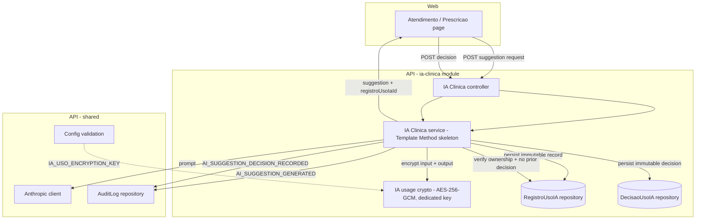

# TDD — AI Usage Audit Trail

Derives from: `docs/harness/features/feature-ai-usage-audit-trail.md` (the 4
Context Pillars answers below are copied verbatim from that feature harness
file; they are the user's answers and were not written or completed by the
agent).

---

## 1. Header & Metadata

| Field | Value |
|-------|-------|
| Status | Draft — pending review |
| Feature | AI Usage Audit Trail (`feature-ai-usage-audit-trail`) |
| Module | `ia-clinica` (API), `atendimento` / `prescricao` pages (web) |
| Tech lead | Erico Lima |
| Team | N/A — solo / small team, no formal squad |
| Epic / ticket | N/A — no epic-tracking system exists for this project yet. Originates from security audit 2026-08-08 (`infra/AUDITORIA-2026-08-08.md`), item "log de uso de IA em ia-clinica.service.ts" |
| Size | Medium (1–4 weeks) |
| Project type | PII + Auth + production system |
| Created | 2026-09-05 |
| Last updated | 2026-09-05 |

---

## 2. Technical Solution

### 2.1 Decision summary

Every AI clinical suggestion (therapy approach or care prescription) is
persisted, at generation time, as an **immutable, encrypted usage record**.
Before the suggestion can leave the screen, the psychologist who generated it
must record an explicit **decision** (accepted or discarded), which is itself
persisted as an immutable record linked one-to-one to the usage record. Both
events are also written to the existing `audit_logs` collection.

**Design patterns committed to** (from the feature file's suggested list):

- **Repository** — persistence for the usage record and the decision record is
  encapsulated behind repository interfaces (port/adapter), mirroring the
  existing `AuditLogRepository` split already in the codebase. Non-optional.
- **Template Method** — the two suggestion operations share one fixed skeleton
  (*call AI → encrypt input and output → persist usage record → write audit
  log → return suggestion + record id*). The skeleton is defined once; each
  operation supplies only the prompt-building step and its usage type. Applied
  only if it does not add indirection that hurts readability for two call
  sites — implementer's judgment at the Green step.

Memento is **not** committed to as a structural decision; it is only a naming
aid for "the usage record is an opaque immutable snapshot of the AI output".

### 2.2 Architecture overview

### 2.3 Data flow

**Generation**

1. Authenticated psychologist submits a suggestion request (existing endpoints).
2. Service builds the prompt (unchanged) and calls the Anthropic client.
3. On a successful AI response, the service encrypts the serialized request
   payload and the full AI output with the dedicated key.
4. The service persists one `registros_uso_ia` document (immutable).
5. The service writes an `AI_SUGGESTION_GENERATED` entry to `audit_logs`.
6. Only after 4 and 5 succeed, the service returns the suggestion **plus** the
   new usage-record id.

**Decision**

1. Psychologist chooses "use this suggestion" or "discard" in the UI.
2. Web calls the new decision endpoint with the usage-record id and the choice.
3. Service loads the usage record; rejects if it does not exist, if it belongs
   to another clinic/user context, or if a decision already exists for it.
4. Service persists one `decisoes_uso_ia` document (immutable).
5. Service writes an `AI_SUGGESTION_DECISION_RECORDED` entry to `audit_logs`.
6. Web applies the current behaviour: "use" copies the text into the target
   field; "discard" clears the suggestion from the screen.

### 2.4 API contracts

Existing endpoints keep their path, guards and throttle. Guards on the whole
controller: authenticated JWT + tenant required + role `PSICOLOGO`. Throttle:
10 requests / 60 s (controller-level, applies to the new endpoint too).

| Endpoint | Method | Request body | Success response | Change |
|----------|--------|--------------|------------------|--------|
| `/ia-clinica/sugerir-abordagem` | POST | unchanged (clinical content only, never identifiable PII) | `{ sugestao: string, registroUsoIaId: string }` | **response gains `registroUsoIaId`** (additive) |
| `/ia-clinica/gerar-prescricao` | POST | unchanged | `{ prescricao: string, registroUsoIaId: string }` | **response gains `registroUsoIaId`** (additive) |
| `/ia-clinica/registros/:id/decisao` | POST | `{ decisao: "ACEITA" \| "DESCARTADA" }` | `{ registroUsoIaId: string, decisao: "ACEITA" \| "DESCARTADA", decididoEm: string (ISO-8601) }` | **new** |

Error responses for the new endpoint:

| Condition | HTTP status |
|-----------|-------------|
| `:id` does not match any usage record (within the caller's clinic context) | 404 |
| Caller is not the user who generated the suggestion | 403 |
| A decision already exists for `:id` | 409 |
| `decisao` missing or not one of the two allowed values | 400 |

### 2.5 Database changes

Two new MongoDB collections. No migration of existing data (nothing to
backfill); collections are created lazily on first write. `autoIndex` is off
outside development, so the indexes below are part of the deployment step
(index creation script / startup ensure-index), consistent with the existing
project convention.

**Collection `registros_uso_ia`** — one document per AI suggestion generated.

| Field | Type | Notes |
|-------|------|-------|
| `clinicaId` | string | tenant scope; immutable |
| `usuarioId` | string | psychologist who generated the suggestion; immutable |
| `tipo` | enum `SUGESTAO_ABORDAGEM` \| `PRESCRICAO_CUIDADOS` | immutable |
| `modelo` | string | AI model id, taken from configuration, not hardcoded; immutable |
| `inputCifrado` | string (ciphertext) | encrypted serialized request payload; immutable |
| `inputIv` | string | per-record random IV; immutable |
| `inputAuthTag` | string | GCM auth tag; immutable |
| `outputCifrado` | string (ciphertext) | encrypted full AI output; immutable |
| `outputIv` | string | per-record random IV; immutable |
| `outputAuthTag` | string | GCM auth tag; immutable |
| `criadoEm` | date | default now; immutable |

Indexes: `{ clinicaId: 1, usuarioId: 1, criadoEm: -1 }`.

**Collection `decisoes_uso_ia`** — one document per human decision, at most one
per usage record.

| Field | Type | Notes |
|-------|------|-------|
| `registroUsoIaId` | reference to `registros_uso_ia` | required; immutable |
| `usuarioId` | string | decider (must equal the usage record's `usuarioId`); immutable |
| `decisao` | enum `ACEITA` \| `DESCARTADA` | immutable |
| `decididoEm` | date | default now; immutable |

Indexes: **unique** on `registroUsoIaId` (database-level guarantee of "one
decision per usage record").

**Immutability for both collections**: pre-hooks reject `updateOne`,
`updateMany`, `findOneAndUpdate`, `deleteOne`, `deleteMany` and
`findOneAndDelete` with an error message in the same style already used by
`audit_logs` ("... is immutable and cannot be updated or deleted."). Only
inserts are allowed.

**`audit_logs`**: two new values added to the audit event enumeration —
`AI_SUGGESTION_GENERATED` and `AI_SUGGESTION_DECISION_RECORDED`. Existing
values are neither removed nor reordered. Metadata carried:
`{ clinicaId, tipo, registroUsoIaId }` for generation,
`{ clinicaId, registroUsoIaId, decisao }` for the decision. `clinicaId` is
inside the metadata object because the audit-log adapter derives the
`audit_logs.clinicaId` column from `metadata.clinicaId` — this is how every
tenant-scoped audit event in the system is already written, and without it the
AI events would be the only category not filterable by clinic in `audit_logs`.

### 2.6 New configuration

| Key | Format | Validation |
|-----|--------|------------|
| `IA_USO_ENCRYPTION_KEY` | 32-byte key, same encoding as `PATIENT_DATA_ENCRYPTION_KEY` (base64 / hex / raw UTF-8, must decode to exactly 32 bytes) | **Presence** required in every environment, enforced by the config loader (the required-vars set on the `.env` path, the get-secret-or-throw path on GCP) — identical to `PATIENT_DATA_ENCRYPTION_KEY`; there is no code-level development default. **Placeholder** value rejected in production and staging only, through the existing placeholder list in `config-validation`. **32-byte format** validated when `IaUsoCryptoService` is constructed, in every environment — the same split already used for `PATIENT_DATA_ENCRYPTION_KEY` / `PacienteCryptoService`. Typed on `AppConfig` as **optional** (mirrors `patientDataHashKey?`) so the existing typed config-validation test factory keeps compiling; "required" is guaranteed by the loader + validation, not by the type. |

Documented in `.env.example` with a comment stating its purpose and that it
must be distinct from `PATIENT_DATA_ENCRYPTION_KEY` and from the medical-record
signature secret.

### 2.7 Context threading

The AI service today receives only the request DTO — it has no authenticated
user, tenant or request-metadata context. This feature requires the caller's
`clinicaId` and `usuarioId` (for both collections) and the request IP + user
agent (required fields on `audit_logs`). Threading that context from the
authenticated request into the service is part of this work; the mechanism is
an implementation detail, the requirement is that persisted records and audit
entries carry the true acting user and tenant.

---

## 3. Context Pillars (verbatim from the feature harness file)

**1 — Como descreve a feature?**

> Toda vez que a IA gera uma sugestão clínica (abordagem terapêutica ou
> prescrição de cuidados), o sistema grava um registro permanente de quem
> pediu, o que foi pedido, o que a IA respondeu, com qual modelo e quando — e
> depois exige que o psicólogo diga explicitamente "vou usar isso" ou "vou
> descartar isso" antes de a sugestão sair da tela. Essa decisão também fica
> gravada, permanentemente, ligada ao registro original.

**2 — Qual problema objetivamente ela resolve?**

> Hoje ia-clinica.service.ts chama a Anthropic e devolve o texto pro frontend
> sem gravar nada — nenhuma linha no banco, nenhum evento no audit_logs. É o
> único módulo do sistema sem trilha de auditoria (todos os outros ~50 eventos
> de AuditEvent cobrem paciente, prontuário, financeiro, telemedicina, laudo,
> documento — IA não tem nenhum). Além disso, no frontend, o texto da IA é
> colado direto no campo de texto livre da prescrição sem nenhuma marca de
> origem — depois de colado, não dá mais para saber "isso aqui foi a IA que
> sugeriu" nem "o psicólogo revisou e aceitou isso, ou só copiou sem olhar".
> Se isso vira parte de um plano de cuidados assinado depois, a proveniência
> do trecho gerado por IA se perde de vez.

**3 — Qual a solução esperada e quais trade-offs ela envolve?**

> Solução: nova coleção registros_uso_ia (imutável, criada no momento da
> geração — modelo, input e output cifrados com chave própria, nunca a mesma
> do paciente) + nova coleção decisoes_uso_ia (imutável, criada quando o
> psicólogo aceita ou descarta, referenciando o registro original, um só por
> registro).
>
> Trade-offs:
>
> - Quem pode registrar a decisão: só o mesmo usuarioId que gerou a sugestão,
>   não qualquer psicólogo da clínica. A sugestão nasce dentro do raciocínio
>   clínico de um atendimento específico de um profissional específico;
>   permitir que outro decida quebra o próprio sentido de não repúdio que a
>   feature existe para garantir. Custo: se a sessão cair e outro psicólogo
>   assumir o atendimento, a sugestão pendente fica órfã — aceitável, porque
>   ela nunca vira parte do prontuário sem decisão.
> - Custo de cifrar todo input/output no Mongo: desprezível em performance
>   (AES-256-GCM por chamada é da ordem de microssegundos) e em armazenamento
>   (sugestões são texto curto). O custo real é operacional: mais uma chave
>   para gerenciar/rotacionar (separada da de paciente e da de assinatura de
>   prontuário) e perda de buscabilidade — não dá pra filtrar por conteúdo, só
>   por metadado (tipo, data, usuário, clínica). Aceitável, porque isso é log
>   de auditoria, não uma feature de busca.
> - Retenção: não há política de retenção/expurgo definida em nenhum outro
>   módulo do sistema hoje — esta feature segue o mesmo não-definido (guarda
>   indefinidamente), até existir política formal.

**4 — Qual exemplo ou contexto concreto temos do problema e da solução?**

> Achado de revisão de código: ia-clinica.service.ts é o único módulo sem
> trilha de auditoria, contra ~50 eventos cobrindo todo o resto do sistema.
> Reforça isso o mesmo princípio já validado e em produção no projeto irmão do
> usuário (Sette/distribuidora médica): toda invocação de IA em contexto
> clínico/regulatório gera registro imutável com decisão humana obrigatória.
>
> Há também gancho normativo real, ainda que genérico: a Resolução CFP nº
> 9/2024, Art. 3º, inclui "registro e guarda de informações, considerando a
> responsabilidade ética no manuseio de dados sensíveis" como parte do
> exercício profissional mediado por TDICs — confirmado em fonte primária
> (texto da resolução via LegisWeb/atosoficiais). Ela não especifica esta
> arquitetura nem menciona IA; a decisão de desenho é de engenharia/produto,
> não uma imposição normativa direta.
>
> Correção registrada explicitamente: uma pesquisa inicial trouxe referência a
> NGS2/assinatura ICP-Brasil como se fosse exigência aplicável a este produto.
> Verificado em fonte primária que isso é da Resolução CFM nº 2.314/2022
> (medicina, CRM) e da Resolução COFEN nº 754/2024 (enfermagem, COREN) —
> nenhuma das duas vincula psicólogo (CFP/CRP). Não entra como requisito desta
> feature nem do módulo de prontuário já existente. Verificado também: CFP nº
> 11/2018 exige só "autenticidade, integridade, sigilo e acesso restrito ao
> psicólogo responsável" para prontuário digital (sem NGS2/ICP-Brasil), e a
> Lei nº 14.063/2020 art. 14 permite assinatura eletrônica avançada OU
> qualificada para profissional de saúde — não exige qualificada como piso.

---

## 4. Context

Nuvita Psi is a multi-tenant clinic-management system for psychology
practices. The `ia-clinica` module is a Clinical Decision Support feature: a
psychologist, mid-session, asks the assistant for a suggested therapy approach
or a care prescription. The prompt is built only from clinical content the
psychologist already typed — the system never sends identifiable patient data
(name, CPF, contact) to the AI provider.

Today the module calls the AI provider and returns the text. Nothing is
persisted and nothing is logged. Every other module in the system writes to a
shared, immutable `audit_logs` collection (~50 distinct event types across
patients, medical records, financial, telemedicine, reports, documents,
scheduling). The AI module is the only one with no audit trail at all.

On the web side, the returned text is placed directly into a free-text field
(e.g. the care-prescription field) with no marker of origin. Once pasted,
there is no way to tell which part of a document was AI-suggested, or whether
the psychologist reviewed and accepted it or merely copied it.

Stakeholders: psychologists (users of the suggestion + decision flow), clinic
owners / data controllers (accountable under LGPD and CFP resolutions),
engineering (maintains the audit trail and the encryption key), and any future
auditor or compliance review.

---

## 5. Problem Statement & Motivation

**Problem 1 — No audit trail for AI use.** The AI module produces clinical
content that can end up in a signed care plan, yet leaves no record of who
requested it, what was asked, what the model returned, which model, or when.
Impact: for any incident review, complaint, or CFP/LGPD inquiry involving an
AI-influenced clinical decision, there is nothing to reconstruct. Every other
clinical action in the system is auditable; this one is a blind spot.

**Problem 2 — Lost provenance of AI-generated text.** Once the suggestion is
pasted into a document, its origin is unrecoverable. Impact: a reviewer cannot
distinguish AI-drafted passages from the psychologist's own words, and cannot
tell whether a human explicitly validated the AI content or just copied it.

**Why now.** The gap was raised by the 2026-08-08 security audit. The feature
is small and self-contained, and the cost of retrofitting provenance after
AI-generated text is already spread across historical documents is far higher
than adding the trail before wider use.

**Cost of not solving.** Non-repudiation gap on exactly the class of decision
(AI-assisted clinical judgment) most likely to be questioned; inconsistent
auditability across the product; no data to evaluate whether the AI feature is
actually used well or at all.

---

## 6. Scope

### In scope (V1)

- New immutable collection `registros_uso_ia`, written at suggestion-generation
  time, with input and output encrypted using a dedicated key.
- New immutable collection `decisoes_uso_ia`, one decision per usage record,
  writable only by the user who generated the suggestion.
- New endpoint to record a decision; the two existing suggestion endpoints
  return the new usage-record id.
- Two new `audit_logs` event types for generation and decision.
- New configuration key `IA_USO_ENCRYPTION_KEY` with validation and
  `.env.example` documentation.
- Web: an "AI-generated" label on the suggestion, and "use this suggestion" /
  "discard" actions that each record the corresponding decision, on both the
  Atendimento (therapy approach) and Prescrição (care prescription) screens.
- Fail-closed behaviour: a suggestion is never returned if its usage record
  could not be persisted.

### Out of scope (V1)

- Content search over stored AI inputs/outputs (metadata filtering only).
- Allowing a psychologist other than the generator to record the decision.
- Reversing or amending a decision once recorded (correction would be a new
  linked record in a future version, never an edit).
- A formal data-retention / purge policy (see Open Questions).
- Backfilling provenance for AI text already pasted into existing documents.
- Changing prompts, model selection, or the suggestion content itself.

### Future (V2+)

- Retention / purge policy once one exists at product level.
- Surfacing the decision history inside the medical-record / care-plan view.
- Linking a usage record to the specific appointment or medical record it was
  generated for.
- An admin/audit read view over `registros_uso_ia` (decrypted, access-logged).

---

## 7. Risks

| Risk | Impact | Probability | Mitigation |
|------|--------|-------------|------------|
| Encryption key (`IA_USO_ENCRYPTION_KEY`) lost or rotated without re-encryption → stored audit records become unreadable | H | M | Key managed in GCP Secret Manager alongside the other data keys; the config loader fails fast on a missing key and `config-validation` on the placeholder value, and the 32-byte format is checked at `IaUsoCryptoService` construction; key rotation treated as a documented procedure (out of scope here) that must re-encrypt or keep the old key; `ai_usage_decrypt_failures` metric surfaces it (automated alert pending a notification channel — separate infra task). |
| Persistence fails after a successful (paid) AI call → user sees an error, AI cost already incurred | M | L | Fail closed by design (no suggestion without a record); the persistence path is a local MongoDB write with no external dependency; `ai_usage_persist_failures` metric surfaces it (automated alert pending a notification channel — separate infra task). |
| Response contract change (`registroUsoIaId` added) breaks an out-of-date web client | M | L | Field is additive; existing clients ignore unknown fields; web and API shipped together; no third-party consumers of this internal API. |
| Orphan pending suggestions (session dropped, another psychologist takes over) accumulate | L | M | Accepted trade-off — an undecided suggestion never enters the medical record; the `ai_suggestions_generated_vs_decided` metric makes a large persistent gap visible. If that number is high after the first month in production, a reminder/expiry feature becomes its own work item — not built preventively in V1. |
| Sensitive health content now stored in a second place (beyond the medical record) increases the encrypted-PII surface | M | M | Dedicated key isolates blast radius from patient data and from the medical-record signature secret; records are write-only with no read path in V1; access to the collection follows the same infrastructure controls as `audit_logs`. |
| Unique index on `registroUsoIaId` races under concurrent decision submissions | L | L | Database-level unique constraint is the source of truth; the service also checks first and returns 409; a duplicate-key error is mapped to the same 409. |

---

## 8. Implementation Plan

Every phase is executed test-first (**Red** → **Green** → refactor). There is
no trailing "write tests" phase.

| Phase | Task | TDD cycle | Owner | Estimate |
|-------|------|-----------|-------|----------|
| 1 — Config | `IA_USO_ENCRYPTION_KEY` wired into the config loader (required-vars / get-secret-or-throw) + placeholder check in `config-validation` + `AppConfig` (optional type) + `.env.example` | Red: failing `config-validation` test — the `.env.example` placeholder value is rejected in production/staging and not flagged in development → Green: add the key to the placeholder-checked list, to the loader's required set, and to the config type. No length check here (moves to Phase 3). | TBD | 0.5d |
| 2 — Domain | Usage-type and decision enums | Red: enum-consumption test → Green: enums | TBD | 0.25d |
| 3 — Crypto | Dedicated AES-256-GCM encrypt/decrypt using the new key | Red: failing round-trip test + tampered-authTag test → Green: crypto service (technique copied from patient crypto, own key, not importing it) | TBD | 1d |
| 4 — Persistence | `registros_uso_ia` and `decisoes_uso_ia` schemas + repositories, immutability hooks, indexes (unique on `registroUsoIaId`) | Red: failing tests for insert-only, rejected update/delete, unique decision → Green: schemas + repositories | TBD | 2d |
| 5 — Audit events | Add the two enum values | Red: test asserting both values emitted → Green: enum additions | TBD | 0.25d |
| 6 — Service (generation) | Wrap both suggestion operations with the shared skeleton: encrypt, persist usage record, write audit log, return id; fail closed | Red: failing tests (record persisted for both operations, audit log written, no suggestion returned when persistence fails) → Green: skeleton + wiring | TBD | 2d |
| 7 — Service (decision) | Record-decision operation: ownership check, prior-decision check, persist, audit log | Red: failing tests (404 unknown id, 403 other user, 409 duplicate, happy path + audit log) → Green: operation | TBD | 1.5d |
| 8 — Controller | New decision endpoint under the existing guards + throttle; response DTOs updated | Red: failing endpoint test (guards enforced, validation of `decisao`, status codes) → Green: controller + DTOs | TBD | 1d |
| 9 — Web | "AI-generated" label + use/discard actions wired to the decision endpoint on both pages | Red: failing component/interaction test (label present before accept, both actions call the endpoint with the right decision, discard clears the panel) → Green: UI changes | TBD | 2d |
| 10 — Monitoring | Emit the structured log events defined in §11: `ai_usage_persist_failure` (generation fail-closed catch) and `ai_decision_endpoint_error` with `status` (decision 404/403/409). `ai_suggestions_generated_vs_decided` needs no new code (derived from the audit events). `ai_usage_decrypt_failures` is deferred — no V1 call site (§11, §14 #8). | Red: test asserting the failure paths log the agreed structured event → Green: logging | TBD | 0.5d |
| — | Full battery: API build, API tests, web typecheck, web build | — | TBD | 0.5d |

---

## 9. Security Considerations

**Authentication / authorization.** All endpoints (existing and new) require an
authenticated JWT, a resolved tenant, and the `PSICOLOGO` role — no change to
the model. The decision endpoint adds a per-record authorization rule: the
caller must be the same user who generated the suggestion (non-repudiation).
Tenant scoping: a usage record is only addressable within its own
`clinicaId`.

**Encryption at rest.** Request payload and AI output are encrypted with
AES-256-GCM, a random IV per record, and an auth tag, before they touch
MongoDB. The key `IA_USO_ENCRYPTION_KEY` is **distinct** from
`PATIENT_DATA_ENCRYPTION_KEY` and from the medical-record signature secret —
separate secret domains so a compromise of one does not expose the others.
Key stored in GCP Secret Manager; the config loader fails fast on a missing
key in every environment, and `config-validation` fails fast on the
`.env.example` placeholder value in production/staging. The 32-byte format is
checked when `IaUsoCryptoService` is constructed, in every environment.

**Encryption in transit.** All traffic terminates TLS at Cloud Run; the AI
provider call is HTTPS. No change.

**PII handling and retention.** Stored inputs/outputs contain sensitive health
content (LGPD art. 11) but, by the existing DTO constraints, no directly
identifying data (name, CPF, contact) — the AI module already forbids that.
Records are write-only in V1: no API read path, no list, no decrypt endpoint.
Retention: indefinite, matching every other collection in the system today;
there is no purge policy anywhere yet (tracked in Open Questions).

**Compliance.** Aligns with CFP nº 9/2024 art. 3 (registro e guarda de
informações no exercício mediado por TDICs) and CFP nº 11/2018 (autenticidade,
integridade, sigilo, acesso restrito) for the underlying medical record.
NGS2 / ICP-Brasil qualified signatures are **not** required for psychologists
(that is CFM 2.314/2022 and COFEN 754/2024, other councils); Lei 14.063/2020
art. 14 allows advanced or qualified electronic signature for health
professionals and does not mandate qualified as a floor. This feature adds an
audit trail, not a signature.

**Secrets management.** One new secret, provisioned the same way as the
existing data keys (GCP Secret Manager → Cloud Run env). Documented in
`.env.example` only as a named placeholder; never committed with a value.

**Audit logging.** Both new events go to the immutable `audit_logs`
collection with the acting user, IP, user agent, timestamp and a minimal
metadata object (`clinicaId`, `tipo`, `registroUsoIaId`, `decisao` as
applicable — `clinicaId` also populates the row's tenant column) — never the
suggestion content.

**Input validation / rate limiting.** The decision body is a closed enum
(`ACEITA` | `DESCARTADA`); anything else is 400. The controller throttle
(10/60 s) covers the new endpoint. No user-controlled free text enters the new
endpoint.

**What must never be logged / put in metadata / returned:** the encryption
key, decrypted or raw AI input/output, prompt content, or any patient clinical
text. Application logs and audit metadata carry ids and enums only.

---

## 10. Testing Strategy

| Test type | Scope | Approach |
|-----------|-------|----------|
| Unit | Dedicated crypto service | Round-trip encrypt→decrypt returns the original; a tampered auth tag makes decryption throw; mirrors the existing patient-crypto spec. |
| Unit | Config validation | The `.env.example` placeholder value for `IA_USO_ENCRYPTION_KEY` is rejected in production and staging and ignored in development. (32-byte format is covered by the crypto-service tests; missing-key enforcement rides on the existing config-loader mechanism.) |
| Unit | Persistence layer (schema definition) | DB-free assertions on the compiled schemas: `Schema.indexes()` includes the unique index on `registroUsoIaId` and the `{ clinicaId, usuarioId, criadoEm }` compound index; every field carries `immutable: true`; `criadoEm` / `decididoEm` declare a default; a `pre` hook is registered for each of `updateOne`, `updateMany`, `findOneAndUpdate`, `deleteOne`, `deleteMany`, `findOneAndDelete`. This catches a dropped hook or a dropped `unique` flag; it does **not** prove Mongoose enforces them at runtime (see note below). |
| Unit | Generation flow (service) | Both suggestion operations persist one usage record with the encrypted input/output, the config model, the acting user/tenant; `AI_SUGGESTION_GENERATED` written to audit log; when persistence fails, no suggestion is returned. |
| Unit | Decision flow (service) | Unknown id → 404-class error; caller ≠ generator → 403-class error; existing decision → 409-class error; happy path persists the decision and writes `AI_SUGGESTION_DECISION_RECORDED`. |
| Integration | Decision endpoint | Guards enforced (401 / 403 by role); `decisao` validation (400); status codes 404 / 403 / 409 / 200 as specified; throttle applies. |
| Component / interaction | Web, both pages | The "AI-generated" label is present before the suggestion can be accepted; "use" copies the text **and** calls the endpoint with `ACEITA`; "discard" clears the panel **and** calls with `DESCARTADA`. |

**Critical scenarios**

- AI succeeds, persistence fails → user gets an error, **no** suggestion text
  in the response, failure is logged/metered.
- Double decision (e.g. double-click) → exactly one `decisoes_uso_ia`
  document, second attempt returns 409.
- Decision attempted by a colleague who took over the session → 403, no
  document written.

**Test data management.** No production data. Crypto tests use a fixed test
key. No test touches a database — the suite has no MongoDB (real or in-memory)
and this feature does not add one. Existing tests are not modified (project
rule: new tests only).

**Runtime enforcement of the immutability hooks and the unique index.** These
are Mongoose schema configuration, replicated verbatim from `audit_logs` /
`observacoes_paciente`. As in those modules, there is **no automated test that
proves Mongoose rejects an `updateOne` or a duplicate decision at runtime** —
the suite has no database layer. The guarantee rests on: (1) the DB-free
schema-definition assertions above, (2) code inspection and PR review that the
hooks and `unique` flag match the reference schemas, and (3) verification on
the first real deployment, exactly as done for `audit_logs`. Raising the
project's schema/repository test rigor (e.g. introducing an in-memory MongoDB)
is a separate, project-wide backlog item, not part of this feature — see §14.

---

## 11. Monitoring & Observability

| Metric | Description | Alert threshold | V1 call site |
|--------|-------------|-----------------|-------------|
| `ai_usage_persist_failures` | AI responded but the usage record failed to persist (the fail-closed path) | Any occurrence (> 0 in a rolling window) — page/notify | Phase 10 — structured log `event: ai_usage_persist_failure` in the generation service's fail-closed catch |
| `ai_decision_endpoint_errors` | Rate of 4xx/5xx on the decision endpoint, split by status (409 conflict, 403 forbidden, 404 not-found) | Sustained elevated 409/403 rate (indicates a web bug letting users double-decide or decide as the wrong user) | Phase 10 — structured log `event: ai_decision_endpoint_error` with `status` before each 404/403/409 throw in the decision service |
| `ai_suggestions_generated_vs_decided` | Gap between `AI_SUGGESTION_GENERATED` and `AI_SUGGESTION_DECISION_RECORDED` counts over a rolling window | Large and persistent gap (orphan suggestions / poor decision UX / suggestions not seen as useful) — review signal, not a page | **No new code** — derived from the two `audit_logs` event counts already written in Phases 5–7 |
| `ai_usage_decrypt_failures` | Any decryption failure reading a usage record | Any occurrence — should be zero in normal operation; non-zero implies a broken key rotation or data corruption | **Deferred — no call site in V1.** §6 and §9 fix V1 as write-only: no API read path, no list, no decrypt endpoint, so there is no code path that decrypts a usage record and therefore nothing to instrument. A structured log that can never fire is false coverage, not observability (same reasoning already applied to orphan suggestions, retention policy and pending-suggestion UX — not built preventively for a scenario that does not yet exist). The metric name and intent are kept here so that whoever adds the first read/decrypt path — most likely the V2 admin/audit read view (§6 "Future"), or the appointment/medical-record link — wires `event: ai_usage_decrypt_failure` at that point. Tracked in §14 #8. |

**Structured log format.** JSON lines, consistent with the rest of the API:
`{ level, msg, event, clinicaId, usuarioId, registroUsoIaId?, decisao?,
status?, stage? }`. Emitted through the NestJS `Logger` (the API has no metrics
library — prom-client / OpenTelemetry is a project-wide infrastructure
decision, not one made inside this feature; the metrics above are *defined and
emitted as structured log events* and derived downstream, exactly as the
alert-channel mechanism is deferred). The fail-closed path logs at `error` with
a stable `event` value; the decision 4xx path logs at `warn` with `status`.

`ai_usage_persist_failure` carries a `stage` field to tell the two fail-closed
write failures apart without reading the stack trace — `stage:
"persist_registro"` (the write to the new `registros_uso_ia` collection failed)
vs `stage: "audit_log"` (the `AI_SUGGESTION_GENERATED` write to the existing
`audit_logs` collection failed). Same `event` and same severity (both withhold
the suggestion); only the origin differs, so it is one field, not two events.

**Never logged:** encryption key, prompt text, AI input, AI output, any
patient clinical content.

**Alerting status.** No alert notification channel (email, Slack, PagerDuty,
Sentry) is configured for this project today. The hardening guide
(`infra/PRODUCTION-BACKEND.md` §8, `infra/GCP-SECRETS-KMS-SETUP.md`)
*specifies* Cloud Monitoring alert policies but they are still pending setup,
and no channel is named anywhere. Standing up a notification channel and the
alert policies is a **separate infrastructure task, out of scope for this
feature**. Until it exists, the metrics below are defined and (for the three
with a V1 call site) emitted but have **no automated alert** — they are
dashboard / periodic-review signals only. When the channel is created, wire
these in with the intended severities:

| Metric | Intended severity when a channel exists | Intended trigger |
|--------|----------------------------------------|------------------|
| `ai_usage_persist_failures` | High | > 0 in a rolling window |
| `ai_usage_decrypt_failures` | High | > 0 — *only once a read/decrypt path exists (deferred, see the metrics table above and §14 #8)* |
| `ai_decision_endpoint_errors` (409/403) | Medium | sustained elevated rate |
| `ai_suggestions_generated_vs_decided` | Low | large, persistent gap |

---

## 12. Rollback Plan

**Deployment strategy.** Standard pipeline: GitHub Actions → Cloud Run. No
feature-flag system exists; the change ships as a normal revision. API and web
deploy together.

**Rollback strategy.** Redeploy the previous Cloud Run revision. The two new
collections are additive and inert if unused — they are **left in place** on
rollback (no down-migration, no data deletion). The new configuration key can
stay set. A rolled-back API simply stops writing to the new collections and
returns the old response shape; a rolled-back web stops showing the
use/discard actions.

| Rollback trigger | Condition |
|------------------|-----------|
| `ai_usage_persist_failures` sustained | The fail-closed path is firing for real users (they cannot get suggestions) |
| Error rate on `/ia-clinica/*` above the agreed API-wide threshold after deploy | Regression in the suggestion flow |
| `ai_usage_decrypt_failures` > 0 right after deploy | Key/config wrong in the environment |

**Rollback steps (strategy, not commands).**

1. Redeploy the previous known-good revision (API, and web if affected).
2. Confirm the suggestion endpoints return normally and error metrics recover.
3. Leave `registros_uso_ia` / `decisoes_uso_ia` and `IA_USO_ENCRYPTION_KEY` in
   place.
4. Post-rollback RCA: why the path failed (config, index creation, context
   threading), fix, re-attempt.

---

## 13. Dependencies

- **Anthropic API** — unchanged; the feature only records around the existing
  call.
- **Existing `AuditLog` repository + `audit_logs` collection** — the two new
  events are written through it; requires the request IP + user agent, which
  the AI path does not currently capture (see §2.7).
- **Config validation module** — hosts the new key's validation, following the
  existing `PATIENT_DATA_ENCRYPTION_KEY` rule.
- **GCP Secret Manager** — provisioning `IA_USO_ENCRYPTION_KEY` for
  staging/production is an operational blocker before deploy (same step as the
  other data keys; tracked with the hardening secrets work).
- **Existing patient-crypto implementation** — reference for the encryption
  technique only; not a code dependency (not imported).

---

## 14. Open Questions

| # | Question | Owner | Status |
|---|----------|-------|--------|
| 1 | Data-retention / purge policy for `registros_uso_ia` and `decisoes_uso_ia` (and, by extension, `audit_logs`) | Product | **Resolved for V1** — deferred. No module in the system has a formal retention/purge policy today; this feature follows the same pattern (keep indefinitely) until one exists. |
| 2 | Alert channels for the four metrics in §11 | Infra | **Resolved for V1** — no alert notification channel is configured for the project today. Standing one up (plus the alert policies already specified in `infra/PRODUCTION-BACKEND.md` §8) is a separate infra task. Until then the four metrics are emitted but not alerted; see §11 "Alerting status". |
| 3 | Should the usage record link to the specific appointment / medical record it was generated for | Product | **Resolved** — V2, out of scope now. The accept/discard decision is sufficient traceability for what this feature promises; coupling suggestion traceability to a specific appointment/record is not justified in V1. |
| 4 | Orphan-suggestion UX (undecided suggestion when the psychologist leaves the screen) | Product | **Resolved for V1** — no special UX. An undecided suggestion is only a signal in the `ai_suggestions_generated_vs_decided` metric. If that number is high after the first month in production, a reminder/expiry feature becomes its own work item. |
| 5 | Tech lead, team, epic/ticket link for the header | — | **Resolved** — tech lead: Erico Lima; team: N/A (solo / small team); epic: N/A (no epic-tracking system for this project). |
| 6 | Project-wide schema/repository test rigor — the suite has no database layer, so immutability hooks and unique indexes are trusted by inspection across every module (`audit_logs`, `observacoes_paciente`, this feature). Introducing an in-memory MongoDB would be a CI-infrastructure decision. | Eng | **Out of scope for this feature.** Separate, funded backlog item — not to be bolted onto an AI feature. This feature follows the existing no-DB-test pattern (§10). |
| 7 | `nest-conventions.md` point 6 requires domain objects as `class`, but ~15 existing modules use `interface` for entities and repository ports. This feature mirrors the existing `interface` practice for reading consistency. | Eng | **Out of scope for this feature.** Separate decision: either update `nest-conventions.md` to match actual practice, or deliberately migrate existing modules to `class`. Not decided inside this feature. |
| 8 | `ai_usage_decrypt_failures` (§11) has no code path to instrument in V1 — the feature is write-only (no read/list/decrypt endpoint per §6, §9). | Eng | **Deferred, not dropped.** Phase 10 emits the other three metrics; this one is defined in §11 with no V1 call site. Whoever adds the first path that decrypts a stored usage record — the V2 admin/audit read view (§6 "Future"), or a decrypt performed alongside the appointment/medical-record link (#3) — wires `event: ai_usage_decrypt_failure` there. Not built preventively for a scenario that does not yet exist (same reasoning as #1, #4 and the retention policy). |
